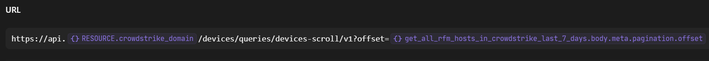

# Working with Pagination Loops in Tines

In my previous [blog](https://automatesecops.github.io/Tines-AI-Winner/), I wrote about my six month journey with the Tines platform, resulting in the top prize for the AI Efficiency category. In this blog, I explain how I used a pagination loop for collecting CrowdStrike hosts in RFM. Here is the Tines Story for my [CrowdStrike RFM report](https://www.tines.com/library/stories/1257278/?name=generate-a-crowdstrike-rfm-report-with-ai) workflow that won top prize.

What is a pagination loop?

Most REST APIs provide a limit number of results when querying a REST endpoint.  To gather all the results, a developer would request the next set of results or the next page. After looping or paging through all the results, the code creates an array of the results, which can be used downstream.

Here's an example of a *Python pagination loop* from [StackOverflow](https://stackoverflow.com/questions/73474642/api-pagination-loop):
```python
import requests
import json
import pandas as pd
from pandas import json_normalize

page = 1
data_nested = []
loop = []

while data_nested is not None:
    data = [('vendor_id', xxxxx),('vendor_auth_code','4803155ec5f5a17d589b650cxxxxxxxxx'),('results_per_page',200),('page',page)]
    response = requests.post(url, headers=headers , data = data)
    data_nested = response.json()['response']
    data_flattened = pd.json_normalize(data_nested)
    df = pd.DataFrame.from_dict(data_flattened)
    loop.append(df)
    if len(df.index)==0:
        break
    page += 1   
pd.concat(loop)
```

Working with the Tines Customer Success Team, I learned a simple pagination loop that I reuse in all my workflows.

The series of actions starts with the inital HTTP request Tines action. 
1. The results are collected into an array. 
2. The workflow checks to see if there are additional results. (Tines Trigger action)
3. If there are, the workflow moves into the pagination loop to query the REST endpoint for the next set of results. 
4. The results are combined with the initial results in the second Host Array action. 
5. The pagination loop goes back to the Trigger action to see if there are more results.
6. If there are additional results, the workflow enters back into the loop. 
7. Once all the results are collected, the workflow exits the pagination loop to move on to the next series of actions.

### TIP: Use the same name in the initial HTTP request and Host Array Event Transformation actions and the subsequent ones in the pagination loop.


### API Schema Pagination Example
You can tell how much time, money, and effort a company puts into their API development by looking at their documentation and the API schema. For example, CrowdStrike puts an enormous amout of time and effort into their Falcon API.  A security analyst can accomplish the same tasks with the REST API as in the console. The API client/key secret pair can be scoped to limit the ability to what actions an API key can accomplish.

In regards to pagination, CrowdStrike provides the means to go to the next page of results with the payload response.  In the Tines event, we see the CrowdStrike response. Under meta>pagination, there are the total number of results along with the next set of results (offset):


## Tines Actions in a Pagination Loop
Let's dive deep into each Tines action.

### 1. The Host Array Action
Using the Event Transformation Action in message mode, we create an array containing the list of asset IDs from the intial HTTP Request Action:


### 2. Trigger Action
The trigger action rule needs to be configured based on the last pagination results in order to exit the loop and to avoid an infinite loop. We see below that CrowdStrike provides a total number of zero or the offset is empty.


I based my trigger action rule on the total number of results left:


If there are additional results, the total number of results are not equal to zero, the workflow enters back into the pagination loop, or exits if the results are zero.

### 3. The HTTP Request in the Pagination Loop
To configure pagination in the CrowdStrike HTTP Request action, use the pill to reference the offset link under meta>pagination>offset from the initial HTTP response. It is simple and straightforward.




### 4. The Host Array Action
The Host Array action in the pagination loop concatenates the results from the second HTTP request with the initial Host Array action. 


The workflow loops back to the Trigger action to check the rule.  If the rule is true (more results), the workflow enters the pagination loop to request the next page and concatenates the results with the array in the host array action. If the rule is false (no more results), the workflow exits the loop along with an array that contains all the results.

What to do with the data collected in the array depends on the purpose of the workflow.  You can filter the array or you can explode each item in the array, such as a Falcon asset ID, to obtain additional host information in a subsequent HTTP request action.

I hope this was helpful.

Once you start automating, you can't stop.

Happy Building!

Tom

## Tines Documenation
- [Tines Pagination Examples Story](https://www.tines.com/library/stories/91375/?name=implement-pagination-with-these-techniques)
- [Tines Concat Function](https://www.tines.com/docs/formulas/functions/concat/)